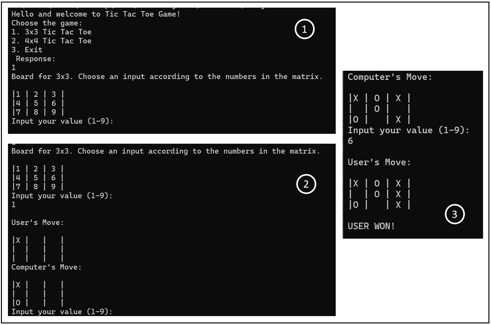
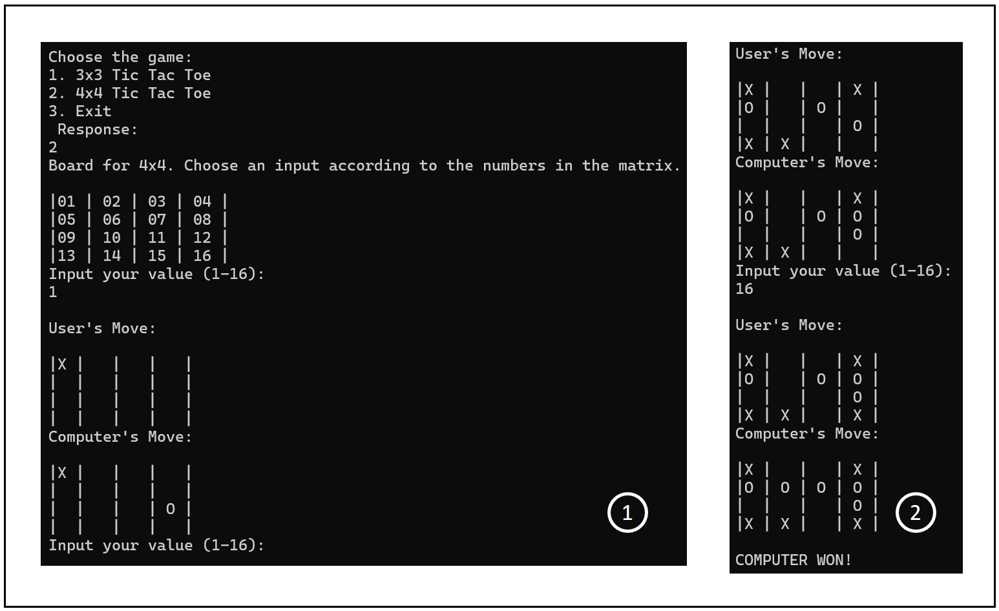

# Tic-Tac-Toe

Tic-Tac-Toe is an X's and O's game, where a opponent wins after getting X or O in one single row or column or diagonal in a 3x3 grid or 4x4 grid.

## Game Execution

```bash

git clone https://github.com/AishwaryaRao19/Tic-Tac-Toe.git
cd ~/Tic-Tac-Toe/src
java Main

```

## Results

- [3x3 Tic Tac Toe example result]
    <p align="center"></p>

- [4x4 Tic Tac Toe example result]
    <p align="center"></p>
